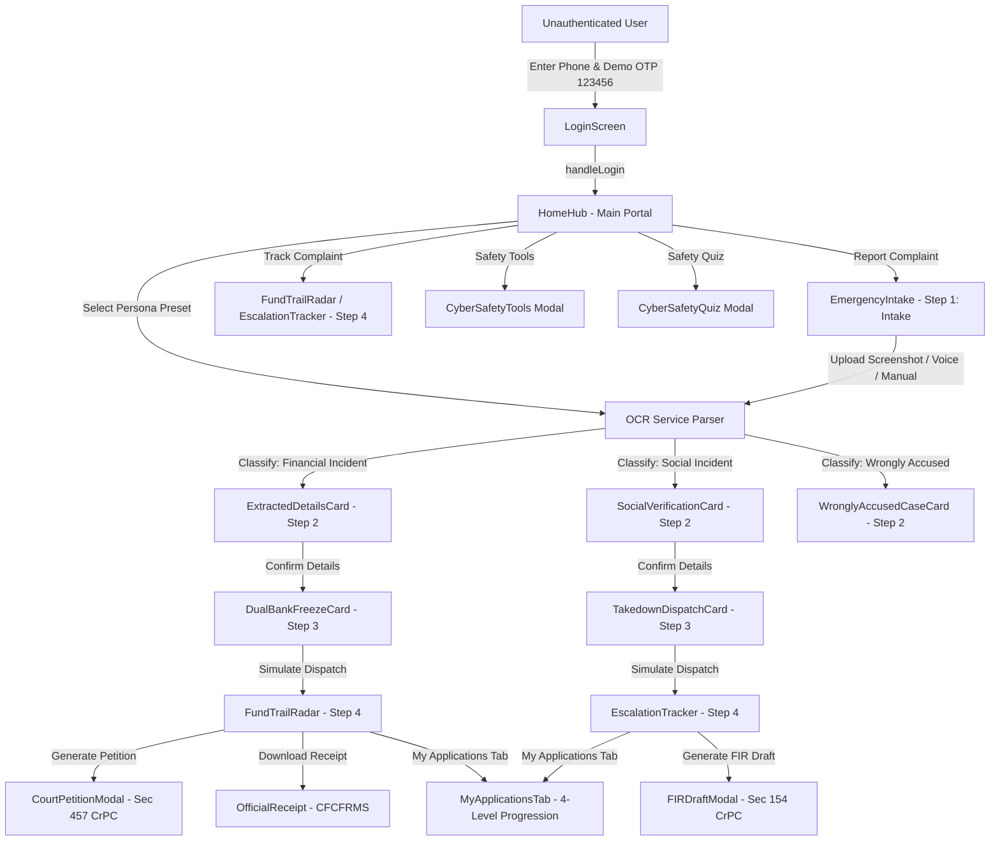

# Kavach (Formerly Kavach 60) — Architectural Brain & Repository Map

> **Master Repository Blueprint & Knowledge Index**  
> *Last Updated: August 2026*  
> *Location: `brain.md`*

---

## 1. Project Overview & Product Mission

**Kavach** is an emergency cybercrime pre-ingestion and support portal engineered for Indian citizens during the critical **"Golden Hour"** (the first 1–2 hours after cyber financial fraud or social harassment occurs).

### The Core Problem It Solves
The official National Cybercrime Reporting Portal ([NCRP](https://cybercrime.gov.in)) and Helpline `1930` are vital national services. However, citizens experiencing panic or distress often struggle with technical jargon, locating 12-digit UTR numbers, determining IFSC codes, finding suspect profile URLs, or knowing which statutory provisions apply (e.g., Section 91 CrPC / 94 BNSS vs. Section 79 IT Act).

### Kavach's Solution
1. **Evidence-First Intake**: Instead of confronting victims with dense multi-page forms, Kavach allows victims to drop a payment screenshot (e.g., Google Pay, PhonePe, Paytm, IMPS), provide a social media URL/screenshot, speak in Hindi or English, or pick a demo scenario.
2. **In-Browser Vision OCR & Intent Classification**: Extracts transaction metadata (UTR, amount, beneficiary VPA, bank names) or social harassment details directly on the client side using Tesseract.js and regex heuristic parsers.
3. **Statutory Action Generation**:
   - **Financial Stream**: Previews dual-bank freeze directives (victim's bank + fraudster's beneficiary bank) and prepares a Section 457 Cr.P.C. / Section 503 BNSS court refund petition.
   - **Social Stream**: Generates a Section 79 IT Act 36-hour statutory takedown notice and drafts a Section 154 Cr.P.C. / Section 173 BNSS police FIR complaint.
4. **Interactive Tracking & Telemetry**: Demonstrates real-time multi-tier mule account tracking (Radar) and grievance escalation status.
5. **Civic Cyber-Safety Suite**: Interactive scam text analyzer, suspicious link checker, cyber-safety health dashboard, and a 90-second safety quiz.
6. **Government Light Design System**: Built on a "Minimalist Government" aesthetic (high contrast, warm paper canvas, crisp ink, formal navy, urgent red, clear hierarchy) inspired by GOV.UK, USWDS, and India.gov.in.

---

## 2. Technology Stack & Architectural Summary

| Layer | Technology | Key Details |
| :--- | :--- | :--- |
| **Framework** | **React 19** (`react`, `react-dom`) | Modern functional components, hooks, strict error boundaries |
| **Build & Dev Tool** | **Vite 8** (`vite`, `@vitejs/plugin-react`) | High-speed HMR, custom `/api/chat-assistant` dev server proxy |
| **Language** | **TypeScript 5.x / 6.x** | Fully typed interfaces, strict null checks, zero `any` in core data models |
| **Styling & Theme** | **Tailwind CSS v4** (`tailwindcss`, `@tailwindcss/vite`) + Custom CSS | CSS custom properties, `@theme`, light/dark mode via `[data-theme]` |
| **Icons** | **Lucide React** (`lucide-react`) | Consistent iconography throughout the app |
| **Client-Side OCR** | **Tesseract.js** (`tesseract.js`) | In-browser OCR rasterization, web-worker execution, confidence scoring |
| **Speech-to-Text** | **Web Speech API** (`SpeechRecognition`) | Native browser speech recognition supporting `en-IN` and `hi-IN` |
| **Document Export** | **html2pdf.js** + Native Print CSS | Client-side vector-rendered PDF downloads with iOS Safari share sheet fallbacks |
| **Animations & FX** | **Canvas-Confetti** (`canvas-confetti`) + CSS Keyframes | Confetti celebrations on quiz completion, smooth view transitions |
| **Code Quality** | **Oxlint** (`oxlint`) + TypeScript Compiler | High-performance linting and type verification |

---

## 3. Master Application State Machine & User Journeys

The central state machine is hosted in [`src/App.tsx`](file:///c:/Users/hp/.gemini/antigravity-ide/scratch/kavach60/src/App.tsx). Navigation is synchronized with the browser's `History API` (`pushState`, `replaceState`, `popstate`), ensuring seamless browser back/forward button behavior and deep modal routing.



### The Three Incident Branches

#### Branch A: Financial Cybercrime (Money Loss via UPI / Netbanking / Mule Accounts)
1. **Intake (`EmergencyIntake.tsx`)**: User uploads UPI debit screenshot, speaks incident, or enters 12-digit UTR manually.
2. **Review (`ExtractedDetailsCard.tsx`)**: Form validation for UTR (12 digits), amount, remitter bank, beneficiary VPA.
3. **Freeze Simulation (`DualBankFreezeCard.tsx`)**: Countdown timer, bank nodal lookup ([`bankNodalDirectory.ts`](file:///c:/Users/hp/.gemini/antigravity-ide/scratch/kavach60/src/data/bankNodalDirectory.ts)), Section 91 CrPC / Section 94 BNSS dual-bank lien payload generation.
4. **Radar & Telemetry (`FundTrailRadar.tsx`)**: Visualizes multi-tier mule trail (`node-0` victim -> `node-1` scammer -> mule accounts) and houses the `MyApplicationsTab` live progress simulation.
5. **Legal Artifacts**:
   - [`CourtPetitionModal.tsx`](file:///c:/Users/hp/.gemini/antigravity-ide/scratch/kavach60/src/components/CourtPetitionModal.tsx): Printable/downloadable Section 457 CrPC / Section 503 BNSS court application for de-freezing and refunding funds to the victim.
   - [`OfficialReceipt.tsx`](file:///c:/Users/hp/.gemini/antigravity-ide/scratch/kavach60/src/components/OfficialReceipt.tsx): Official acknowledgment receipt with CFCFRMS token and QR code.

#### Branch B: Social Media Cybercrime (Impersonation, NCII, Defamation, Harassment)
1. **Intake (`EmergencyIntake.tsx`)**: User uploads profile/chat screenshot, enters profile URL, or describes harassment.
2. **Review (`SocialVerificationCard.tsx`)**: Validates platform (Instagram, Facebook, X, etc.) and suspect URL format.
3. **Takedown Notice (`TakedownDispatchCard.tsx`)**: Generates statutory Section 79 IT Act 2000 notice with a 36-hour compliance countdown dispatched to the platform's Grievance Officer.
4. **Escalation Tracking (`EscalationTracker.tsx`)**: Multi-stage progress tracking from Notice Served -> Platform Review -> Police Escalation, plus `MyApplicationsTab`.
5. **Legal Artifacts**:
   - [`FIRDraftModal.tsx`](file:///c:/Users/hp/.gemini/antigravity-ide/scratch/kavach60/src/components/FIRDraftModal.tsx): Printable Section 154 CrPC / Section 173 BNSS police complaint draft.

#### Branch C: Wrongly Accused Person Defense
- **Card (`WronglyAccusedCaseCard.tsx`)**: For users whose accounts were frozen by mistake due to secondary/tertiary mule linkages. Provides guidance on requesting formal written reasons from the bank and preserving legitimate KYC/invoice proof without paying bribe/unfreeze scammers.

---

## 4. Comprehensive File-by-File Directory

```
kavach60/
├── public/
│   ├── favicon.svg
│   └── icons.svg
├── src/
│   ├── assets/
│   │   ├── hero-banner-dark.png
│   │   ├── hero-banner.png
│   │   ├── hero.png
│   │   ├── hub-hero.jpg
│   │   ├── login-hero-v2.png
│   │   ├── login-hero.jpg
│   │   ├── react.svg
│   │   └── vite.svg
│   ├── components/
│   │   ├── ComplaintAssistant.tsx
│   │   ├── CourtPetitionModal.tsx
│   │   ├── CyberSafetyQuiz.tsx
│   │   ├── CyberSafetyTools.tsx
│   │   ├── DualBankFreezeCard.tsx
│   │   ├── EmergencyIntake.tsx
│   │   ├── ErrorBoundary.tsx
│   │   ├── EscalationTracker.tsx
│   │   ├── EvidenceTipsModal.tsx
│   │   ├── ExtractedDetailsCard.tsx
│   │   ├── FIRDraftModal.tsx
│   │   ├── FundTrailRadar.tsx
│   │   ├── Header.tsx
│   │   ├── HomeHub.tsx
│   │   ├── LoginScreen.tsx
│   │   ├── MockedTransparencyHub.tsx
│   │   ├── MyApplicationsTab.tsx
│   │   ├── OfficialReceipt.tsx
│   │   ├── PersonProfileSummary.tsx
│   │   ├── PrototypeBoundaryBanner.tsx
│   │   ├── PrototypeBoundaryModal.tsx
│   │   ├── SiteFooter.tsx
│   │   ├── SocialVerificationCard.tsx
│   │   ├── StepTracker.tsx
│   │   ├── TakedownDispatchCard.tsx
│   │   ├── ThemeToggle.tsx
│   │   └── WronglyAccusedCaseCard.tsx
│   ├── data/
│   │   ├── bankNodalDirectory.ts
│   │   ├── cyberSafetyQuiz.ts
│   │   ├── mockPersonas.ts
│   │   └── sampleScreenshots.ts
│   ├── services/
│   │   ├── chatAssistantService.ts
│   │   ├── cyberSafetyService.ts
│   │   ├── ocrService.ts
│   │   ├── speechService.ts
│   │   └── storageService.ts
│   ├── types/
│   │   └── index.ts
│   ├── utils/
│   │   ├── browser.ts
│   │   ├── formatters.ts
│   │   ├── pdfExport.ts
│   │   └── sanitizers.ts
│   ├── App.css
│   ├── App.tsx
│   ├── index.css
│   └── main.tsx
├── .env.example
├── .gitignore
├── .oxlintrc.json
├── brain.md
├── COMPETITIVE_RESEARCH.md
├── design_system.md
├── IMPROVEMENT_PROMPT.md
├── index.html
├── integration_guide.md
├── package.json
├── package-lock.json
├── postcss.config.cjs
├── README.md
├── tsconfig.app.json
├── tsconfig.json
├── tsconfig.node.json
└── vite.config.ts
```

---

### 4.1. Root Files & Build Configurations

#### [`package.json`](file:///c:/Users/hp/.gemini/antigravity-ide/scratch/kavach60/package.json)
- **Purpose**: Defines dependencies, scripts, and build metadata.
- **Key Packages**: `react` 19, `react-dom` 19, `tailwindcss` 4, `@tailwindcss/vite`, `tesseract.js` 7, `html2pdf.js` 0.14, `lucide-react`, `canvas-confetti`, `oxlint`.
- **Scripts**: `npm run dev` (starts Vite on port 5173 with host binding), `npm run build` (`tsc -b && vite build`), `npm run lint` (`oxlint`).

#### [`vite.config.ts`](file:///c:/Users/hp/.gemini/antigravity-ide/scratch/kavach60/vite.config.ts)
- **Purpose**: Vite bundler configuration and custom backend dev server plugin.
- **Custom Plugin (`chatAssistantApi`)**: Intercepts requests to `POST /api/chat-assistant`. If `OPENAI_API_KEY` is present in environment variables, it proxies messages to `gpt-4o-mini` with cyber-safety system instructions. If no API key is provided, it serves rich, multilingual, context-aware rule-based fallback responses instantly without failing.

#### [`index.html`](file:///c:/Users/hp/.gemini/antigravity-ide/scratch/kavach60/index.html)
- **Purpose**: HTML5 document root. Contains viewport configuration, Google Fonts preconnects (`Inter Tight`, `IBM Plex Mono`, `Noto Sans Devanagari`), and mounts `<div id="root"></div>`.

#### [`tsconfig.json`](file:///c:/Users/hp/.gemini/antigravity-ide/scratch/kavach60/tsconfig.json), [`tsconfig.app.json`](file:///c:/Users/hp/.gemini/antigravity-ide/scratch/kavach60/tsconfig.app.json), [`tsconfig.node.json`](file:///c:/Users/hp/.gemini/antigravity-ide/scratch/kavach60/tsconfig.node.json)
- **Purpose**: TypeScript configuration hierarchy. Configures JSX transform (`react-jsx`), ES2022 target, strict type-checking, and path resolutions.

#### [`.oxlintrc.json`](file:///c:/Users/hp/.gemini/antigravity-ide/scratch/kavach60/.oxlintrc.json) & [`postcss.config.cjs`](file:///c:/Users/hp/.gemini/antigravity-ide/scratch/kavach60/postcss.config.cjs)
- **Purpose**: Linter configuration for high-speed Oxlint checks and PostCSS pipeline integration.

#### [`design_system.md`](file:///c:/Users/hp/.gemini/antigravity-ide/scratch/kavach60/design_system.md) & [`integration_guide.md`](file:///c:/Users/hp/.gemini/antigravity-ide/scratch/kavach60/integration_guide.md)
- **Purpose**: Architectural documentation for design philosophy ("Minimalist Government") and backend integration plans for production deployment with CFCFRMS and NCRP APIs.

---

### 4.2. Styling Architecture & Design Tokens

#### [`src/index.css`](file:///c:/Users/hp/.gemini/antigravity-ide/scratch/kavach60/src/index.css)
- **Purpose**: The master stylesheet (75KB+). Defines the complete design token system using Tailwind v4 `@theme` and CSS custom variables.
- **Light Theme Tokens (`:root, [data-theme="light"]`)**:
  - `--canvas`: `#f2ebe0` (warm paper background)
  - `--card`: `#ffffff` (crisp container background)
  - `--ink`: `#221a14` (dark charcoal ink text)
  - `--muted`: `#66584a` (secondary text)
  - `--line`: `#ded2c1`, `--line-strong`: `#ccbea8` (borders)
  - `--danger`: `#d4351c` (urgent red)
  - `--success`: `#1b8a4b` (forest green)
- **Dark Theme Tokens (`[data-theme="dark"]`)**:
  - `--canvas`: `#12100e`, `--card`: `#1c1916`, `--ink`: `#f5efe6`, `--muted`: `#aba092`, `--line`: `rgba(235, 215, 190, 0.12)`
- **Button Anatomy & Utility Standards**:
  - Rigid geometric tokens: `--btn-height-md: 48px`, `--btn-pad-x: 22px`, `--btn-radius: 999px`.
  - Classes: `.btn-primary`, `.btn-secondary`, `.btn-emergency`, `.btn-ai`, `.btn-icon`, `.btn-group`, `.btn-link`.
- **Print Optimization (`@media print`)**:
  - Overrides canvas to pure `#ffffff`, text to `#000000`, switches typography to serif (`Times New Roman`) for official court & police aesthetics, hides `.no-print` controls, and preserves `.print-content`.

#### [`src/App.css`](file:///c:/Users/hp/.gemini/antigravity-ide/scratch/kavach60/src/App.css)
- **Purpose**: Supplementary component animations and micro-interaction styling.

---

### 4.3. Type Definitions & Data Contracts

#### [`src/types/index.ts`](file:///c:/Users/hp/.gemini/antigravity-ide/scratch/kavach60/src/types/index.ts)
- **Purpose**: Complete TypeScript domain models and interfaces.
- **Key Types & Models**:
  - `Language`: `'en' | 'hi'`
  - `AppStep`: `'intake' | 'review' | 'freeze' | 'radar' | 'petition'`
  - `FraudCategory`: `UPI_PHISHING`, `FAKE_ELECTRICITY_APK`, `DIGITAL_ARREST_EXTORTION`, `TASK_JOB_SCAM`, `QR_CODE_REFUND_FRAUD`, `SOCIAL_MEDIA_IMPERSONATION`, `CYBERBULLYING_HARASSMENT`, `NCII_SEXTORTION`, `HACKING_COMPROMISE`, `OTHER`
  - `CasePerspective`: `'REPORTING_VICTIM' | 'WRONGLY_ACCUSED'`
  - `MockPersonProfile`: Victim profile (name, mobile, age, gender, address, city, state, postal code, occupation)
  - `RadarNode`: Telemetry node in the mule account tracking visualization (tier 0 to 4, bank name, masked account, amount, status)
  - `FraudPersona`: Mock simulation profile definition
  - `BaseIncident`: Common fields across all incidents (`incidentType`, `timestamp`, `victimName`, `confidenceScore`, etc.)
  - `FinancialIncident`: Extends `BaseIncident` with `utr`, `amount`, `remitterBank`, `remitterAccount`, `beneficiaryVpa`, `beneficiaryBank`
  - `SocialIncident`: Extends `BaseIncident` with `platform`, `suspectUrl`, `contentType`
  - `CyberIncident`: Discriminated union of `FinancialIncident | SocialIncident`
  - `BankNodalOfficer`: Directory record for banking nodal escalations
  - `CFCFRMSPayload`: Simulated CFCFRMS API request structure
  - `Sec79Payload`: Simulated Section 79 IT Act takedown notice structure
  - `CourtPetitionDetails`: Data model for Section 457 CrPC court recovery petition

---

### 4.4. Services & Business Logic

#### [`src/services/ocrService.ts`](file:///c:/Users/hp/.gemini/antigravity-ide/scratch/kavach60/src/services/ocrService.ts)
- **Purpose**: Local in-browser evidence extraction and intent classification engine.
- **Functions**:
  - `parseScreenshotOCR(source: File | string)`: Handles image resizing, canvas rasterization, Tesseract worker OCR execution, regex pattern extraction (12-digit UTR, INR currency amounts, `@upi` handles, suspect URLs, bank hints), and persona ID matching.
  - `parseVoiceTranscription(transcript: string)`: Parses spoken Hindi/English strings for fraud keywords and entities.
  - `OcrReadError`: Custom error class handling `HEIC_UNSUPPORTED`, `DECODE_FAILED`, `OCR_TIMEOUT`, `OCR_FAILED`.

#### [`src/services/speechService.ts`](file:///c:/Users/hp/.gemini/antigravity-ide/scratch/kavach60/src/services/speechService.ts)
- **Purpose**: Wrapper around the browser's native `SpeechRecognition` / `webkitSpeechRecognition` API.
- **Features**: Detects Apple touch devices (iOS Safari) to adjust `continuous` and `interimResults` flags to prevent instant crashing, supports switching between `en-IN` and `hi-IN`, manages microphone permissions, and exports a singleton `speechService`.

#### [`src/services/storageService.ts`](file:///c:/Users/hp/.gemini/antigravity-ide/scratch/kavach60/src/services/storageService.ts)
- **Purpose**: Persistence layer managing `localStorage` and `sessionStorage`.
- **Functions**:
  - `saveDraftToStorage(transaction, payload, step, isSubmitted)`: Persists in-progress citizen complaints with a 30-day TTL.
  - `getDraftFromStorage()`: Safely retrieves and parses stored draft cases with version validation (`STORAGE_VERSION = 1`).
  - `clearDraftFromStorage()` & `clearSessionFlowState()`: Wipes drafts, manual input fields, and session deadlines on reset/logout.
  - `getOrCreateSessionDeadline(name, durationSeconds)`: Tracks immutable countdown deadlines for the 30-min Golden Hour and 36-hour Sec 79 compliance timers.
  - `saveLanguagePreference(lang)` & `getLanguagePreference()`: Persists user UI language choice.
  - `saveLastAcknowledgment(ack)`: Stores the latest generated ACK number.

#### [`src/services/cyberSafetyService.ts`](file:///c:/Users/hp/.gemini/antigravity-ide/scratch/kavach60/src/services/cyberSafetyService.ts)
- **Purpose**: Algorithmic rules engine for scam text analysis and URL inspection.
- **Functions**:
  - `analyzeScamContent(content)`: Evaluates text against 10 weighted indicators (urgency, threats/arrest, OTP requests, payment pressure, suspicious links, impersonation, fake KYC, APK installs, CVV requests) and returns a risk score (`LOW`, `MEDIUM`, `HIGH`, `CRITICAL`).
  - `checkSuspiciousLink(input)`: Parses domain hierarchy, tests for non-HTTPS, URL shorteners, risky TLDs (`.zip`, `.xyz`, `.top`), IP-based hostnames, deep subdomains, and deceptive brand imitation (typosquatting).
  - `getCyberSafetyActivity()`, `updateCyberSafetyActivity()`, `calculateCyberSafetyScore()`: Tracks citizen safety practice activities and computes an overall 0–100 Cyber Safety Health Score.

#### [`src/services/chatAssistantService.ts`](file:///c:/Users/hp/.gemini/antigravity-ide/scratch/kavach60/src/services/chatAssistantService.ts)
- **Purpose**: Client-side communication service for the floating AI cyber assistant.
- **Features**: Dispatches conversational queries to `/api/chat-assistant`, with built-in instant local bilingual guidance fallbacks if the network or dev server proxy is offline.

---

### 4.5. Data Stores & Mock Datasets

#### [`src/data/mockPersonas.ts`](file:///c:/Users/hp/.gemini/antigravity-ide/scratch/kavach60/src/data/mockPersonas.ts)
- **Purpose**: Curated synthetic personas for hackathon demonstration and test workflows.
- **Personas**:
  1. `gpay-phishing`: UPI utility bill refund scam (₹48,500, Ramesh Sharma, HDFC -> Axis). Demonstrates dual-bank freeze and Sec 91 CrPC notice.
  2. `investment-fraud`: Digital arrest & stock fraud (₹1,50,000, Prof. Alok Mukherjee, ICICI -> ICICI Mule). Demonstrates multi-tier fund trail radar and Sec 457 refund petition.
  3. `instagram-fake`: Social media cloned account & extortion (Pooja Verma). Demonstrates Sec 79 36-hour platform takedown notice.
  4. `cyber-stalking`: Harassment & blackmail (Sunita Rao). Demonstrates Sec 154 CrPC cyber police FIR petition.
  5. `wrongly-accused`: Account erroneously frozen due to secondary mule linkage (Vikram Malhotra). Demonstrates defense protocols for innocent citizens.

#### [`src/data/bankNodalDirectory.ts`](file:///c:/Users/hp/.gemini/antigravity-ide/scratch/kavach60/src/data/bankNodalDirectory.ts)
- **Purpose**: Static directory of bank nodal cyber cells across major Indian banks (HDFC, Axis, ICICI, SBI, IndusInd, PNB, Paytm Payments Bank, Kotak Mahindra Bank).
- **Functions**: `getBankNodalOfficer(bankIdentifier)` looks up official nodal email, escalation email, 24/7 hotline, and CISO jurisdiction by bank name substring.

#### [`src/data/cyberSafetyQuiz.ts`](file:///c:/Users/hp/.gemini/antigravity-ide/scratch/kavach60/src/data/cyberSafetyQuiz.ts)
- **Purpose**: Multilingual dataset of 5 scenario-based interactive quiz questions (electricity bill APK, fake digital arrest police call, QR code receiving money fraud, urgent KYC SMS, fake bank customer care number) with comprehensive explanations in English and Hindi.

#### [`src/data/sampleScreenshots.ts`](file:///c:/Users/hp/.gemini/antigravity-ide/scratch/kavach60/src/data/sampleScreenshots.ts)
- **Purpose**: Sample mock screenshot data fixtures.

---

### 4.6. Utilities & Helpers

#### [`src/utils/browser.ts`](file:///c:/Users/hp/.gemini/antigravity-ide/scratch/kavach60/src/utils/browser.ts)
- **Purpose**: Device detection and clipboard helpers.
- **Exports**: `isAppleTouchDevice()` (reliably identifies iPadOS/iOS devices), `copyText(text)` (cross-browser clipboard copying with fallback for insecure/iframe contexts).

#### [`src/utils/formatters.ts`](file:///c:/Users/hp/.gemini/antigravity-ide/scratch/kavach60/src/utils/formatters.ts)
- **Purpose**: Data presentation formatting.
- **Exports**: `formatINR(amount)` (converts numbers to Indian Rupee currency format `₹1,50,000`), `formatUTR(utr)` (groups 12 digits into readable 4-digit blocks), `formatTimeRemaining(seconds)` (renders `MM:SS`), `formatDateTimeIN(dateStr)` (renders Indian Standard Time string), `courtBankTitle(name)` (formats bank names cleanly for legal captions).

#### [`src/utils/pdfExport.ts`](file:///c:/Users/hp/.gemini/antigravity-ide/scratch/kavach60/src/utils/pdfExport.ts)
- **Purpose**: High-fidelity client-side PDF document generation.
- **Exports**: `downloadElementPdf(element, filename)`. Dynamically imports `html2pdf.js`, applies custom A4 dimensions and canvas scaling (scale 2.0 on desktop, 1.25 on iOS), invokes the native `navigator.share` Web Share API on mobile devices, or falls back to direct blob download and `window.print()`.

#### [`src/utils/sanitizers.ts`](file:///c:/Users/hp/.gemini/antigravity-ide/scratch/kavach60/src/utils/sanitizers.ts)
- **Purpose**: Input validation and string sanitization.
- **Exports**: `isValidUTR(utr)` (verifies 12 digits), `isValidVPA(vpa)` (validates UPI handle syntax), `isValidIFSC(ifsc)` (validates 11-char IFSC code format), `isValidSuspectUrl(url)` (validates URL protocol and hostname), `sanitizeLegalText(text)` (strips unsafe characters while preserving Devanagari and Latin text for legal petitions).

---

### 4.7. React UI Components (`src/components/`)

#### Navigation & Shell
1. [`Header.tsx`](file:///c:/Users/hp/.gemini/antigravity-ide/scratch/kavach60/src/components/Header.tsx): Top navigation bar with "Kavach" branding, 4-step progress breadcrumbs, direct 1930 helpline badge, EN/HI language switcher, theme toggle, and sign-out button.
2. [`SiteFooter.tsx`](file:///c:/Users/hp/.gemini/antigravity-ide/scratch/kavach60/src/components/SiteFooter.tsx): Clean bottom navigation with links to "New Report", "What's Mocked", "Learn Cyber Safety", and "Evidence & Tips".
3. [`StepTracker.tsx`](file:///c:/Users/hp/.gemini/antigravity-ide/scratch/kavach60/src/components/StepTracker.tsx): Linear horizontal progress bar for mobile and compact screens.
4. [`ThemeToggle.tsx`](file:///c:/Users/hp/.gemini/antigravity-ide/scratch/kavach60/src/components/ThemeToggle.tsx): Sun/Moon icon toggle for switching between Light and Dark themes.
5. [`ErrorBoundary.tsx`](file:///c:/Users/hp/.gemini/antigravity-ide/scratch/kavach60/src/components/ErrorBoundary.tsx): Top-level React error boundary preventing white-screen crashes and managing chunk-reload recovery.

#### Authentication & Hub
6. [`LoginScreen.tsx`](file:///c:/Users/hp/.gemini/antigravity-ide/scratch/kavach60/src/components/LoginScreen.tsx): Clean citizen sign-in page with phone number input and mock OTP verification (`123456`). Features visual artwork, theme switcher, and instant access to the cyber safety quiz.
7. [`HomeHub.tsx`](file:///c:/Users/hp/.gemini/antigravity-ide/scratch/kavach60/src/components/HomeHub.tsx): The central portal homepage. Features a reassuring typewriter hero message ("You are not alone. Take a deep breath"), primary "Report a Fraud" and "Track Existing Complaint" action buttons, one-click scam persona cards, and interactive safety tool triggers.

#### Intake & Verification (Steps 1 & 2)
8. [`EmergencyIntake.tsx`](file:///c:/Users/hp/.gemini/antigravity-ide/scratch/kavach60/src/components/EmergencyIntake.tsx): The primary intake interface. Offers drag-and-drop screenshot upload, microphone voice reporting in Hindi/English, manual 12-digit UTR entry, manual social media complaint entry, and saved draft restoration.
9. [`ExtractedDetailsCard.tsx`](file:///c:/Users/hp/.gemini/antigravity-ide/scratch/kavach60/src/components/ExtractedDetailsCard.tsx): Step 2 (Financial). Displays extracted UTR, amount, and banking details with inline editing capabilities and validation indicators.
10. [`SocialVerificationCard.tsx`](file:///c:/Users/hp/.gemini/antigravity-ide/scratch/kavach60/src/components/SocialVerificationCard.tsx): Step 2 (Social). Validates platform name, suspect profile URL, and harassment summary.
11. [`WronglyAccusedCaseCard.tsx`](file:///c:/Users/hp/.gemini/antigravity-ide/scratch/kavach60/src/components/WronglyAccusedCaseCard.tsx): Step 2 (Wrongly Accused). Guides users whose accounts have been frozen in error on how to request formal written reasons from the bank and submit legitimate trade proof.
12. [`PersonProfileSummary.tsx`](file:///c:/Users/hp/.gemini/antigravity-ide/scratch/kavach60/src/components/PersonProfileSummary.tsx): Reusable citizen profile card summarizing victim identity, occupation, mobile, and residential address.

#### Statutory Action & Tracking (Steps 3 & 4)
13. [`DualBankFreezeCard.tsx`](file:///c:/Users/hp/.gemini/antigravity-ide/scratch/kavach60/src/components/DualBankFreezeCard.tsx): Step 3 (Financial). Simulates dispatching emergency freeze liens under Section 91 CrPC / Section 94 BNSS to both the remitter and beneficiary banks. Includes a live 30-minute countdown timer and raw JSON payload preview.
14. [`TakedownDispatchCard.tsx`](file:///c:/Users/hp/.gemini/antigravity-ide/scratch/kavach60/src/components/TakedownDispatchCard.tsx): Step 3 (Social). Simulates issuing an official Section 79 IT Act Takedown Notice to the social media intermediary with a 36-hour statutory compliance timer.
15. [`FundTrailRadar.tsx`](file:///c:/Users/hp/.gemini/antigravity-ide/scratch/kavach60/src/components/FundTrailRadar.tsx): Step 4 (Financial). Interactive multi-tier banking transaction timeline displaying victim account -> scammer VPA -> mule accounts, with tab switching to `MyApplicationsTab`.
16. [`EscalationTracker.tsx`](file:///c:/Users/hp/.gemini/antigravity-ide/scratch/kavach60/src/components/EscalationTracker.tsx): Step 4 (Social). Visual status tracker monitoring platform grievance officer compliance and cyber cell police escalation.
17. [`MyApplicationsTab.tsx`](file:///c:/Users/hp/.gemini/antigravity-ide/scratch/kavach60/src/components/MyApplicationsTab.tsx): Real-time 4-level application progression tracker (L1: Initial Freeze Request -> L2: Bank Nodal Intercept -> L3: Secondary Mule Freeze -> L4: Court Petition Ready) with auto-advancing live simulation and acknowledgment token copy utility.

#### Legal Documents & Modals
18. [`CourtPetitionModal.tsx`](file:///c:/Users/hp/.gemini/antigravity-ide/scratch/kavach60/src/components/CourtPetitionModal.tsx): Formats a formal legal petition under Section 457 Cr.P.C. / Section 503 BNSS addressed to the Chief Judicial Magistrate (CJM) to release and refund frozen funds. Includes vector PDF download.
19. [`FIRDraftModal.tsx`](file:///c:/Users/hp/.gemini/antigravity-ide/scratch/kavach60/src/components/FIRDraftModal.tsx): Formats a formal cyber police First Information Report (FIR) under Section 154 Cr.P.C. / Section 173 BNSS for social media impersonation and extortion. Includes vector PDF download.
20. [`OfficialReceipt.tsx`](file:///c:/Users/hp/.gemini/antigravity-ide/scratch/kavach60/src/components/OfficialReceipt.tsx): Generates a printable official acknowledgment slip complete with CFCFRMS reference token and QR code.

#### Educational & Transparency Modals
21. [`ComplaintAssistant.tsx`](file:///c:/Users/hp/.gemini/antigravity-ide/scratch/kavach60/src/components/ComplaintAssistant.tsx): Floating conversational AI assistant available across all screens. Offers quick prompts, voice input, and guidance on cybercrime reporting procedures.
22. [`CyberSafetyQuiz.tsx`](file:///c:/Users/hp/.gemini/antigravity-ide/scratch/kavach60/src/components/CyberSafetyQuiz.tsx): 90-second interactive scam scenario quiz with immediate explanations, scoring, and confetti celebrations.
23. [`CyberSafetyTools.tsx`](file:///c:/Users/hp/.gemini/antigravity-ide/scratch/kavach60/src/components/CyberSafetyTools.tsx): Suite containing:
    - **Scam Message Analyzer**: Paste SMS/WhatsApp text to detect indicators of fraud.
    - **Suspicious Link Checker**: URL structural safety inspector.
    - **Cyber-Safety Health Dashboard**: Action checklist computing a 0–100 cyber resilience score.
24. [`EvidenceTipsModal.tsx`](file:///c:/Users/hp/.gemini/antigravity-ide/scratch/kavach60/src/components/EvidenceTipsModal.tsx): Explains how to preserve unedited screenshots, the significance of the 2-hour Golden Hour, locating 12-digit UTR numbers, and never sharing OTPs.
25. [`MockedTransparencyHub.tsx`](file:///c:/Users/hp/.gemini/antigravity-ide/scratch/kavach60/src/components/MockedTransparencyHub.tsx): Explains to hackathon reviewers exactly what is simulated (bank nodal APIs, automated lien locking) versus what runs live in the browser (OCR, voice parsing, PDF generation).
26. [`PrototypeBoundaryModal.tsx`](file:///c:/Users/hp/.gemini/antigravity-ide/scratch/kavach60/src/components/PrototypeBoundaryModal.tsx) & [`PrototypeBoundaryBanner.tsx`](file:///c:/Users/hp/.gemini/antigravity-ide/scratch/kavach60/src/components/PrototypeBoundaryBanner.tsx): Explains the system boundary as a pre-ingestion citizen layer that does not replace real legal or police authorities.

---

## 5. End-to-End Data Flow & Lifecycle

```
[User Action: Screenshot / Voice / Manual Input]
                     │
                     ▼
             [ocrService.ts]
     ┌───────────────┴───────────────┐
     ▼                               ▼
[Financial Incident]          [Social Incident]
     │                               │
     ▼                               ▼
[ExtractedDetailsCard]      [SocialVerificationCard]
     │ (User edits & validates)      │
     ▼                               ▼
[DualBankFreezeCard]        [TakedownDispatchCard]
     │ (Simulate API Dispatch)       │
     ▼                               ▼
[FundTrailRadar]            [EscalationTracker]
     │                               │
     ├─► [CourtPetitionModal]        └─► [FIRDraftModal]
     ├─► [OfficialReceipt]
     └─► [MyApplicationsTab (L1→L4)]
```

### Storage Lifecycle
- **Drafts (`kavach60_emergency_draft`)**: Saved to `localStorage` at each step transition. Automatically restores previous cases if the browser crashes or refreshes.
- **Session Timers (`kavach_demo_deadline_*`)**: Saved to `sessionStorage` so countdown timers (Golden Hour 30 min, Sec 79 36 hours) do not reset to zero on simple page reload.
- **Language Preference (`kavach60_user_lang`)**: Persists user choice (`en` or `hi`) in `localStorage`.
- **Theme (`kavach_theme`)**: Persists `'light'` or `'dark'` in `localStorage`.

---

## 6. Key Developer Guidelines & Rules

1. **Do Not Claim Real Government Authority**: Kavach is an independent citizen pre-ingestion prototype. Disclaimers and boundaries must be preserved in all copy.
2. **Strict Button Anatomy**: Do not apply ad-hoc Tailwind padding/height classes (`px-4`, `py-2`, `h-10`) to buttons. Always use the predefined design tokens (`.btn-primary`, `.btn-secondary`, `.btn-emergency`, `.btn-icon`, `.btn-group`).
3. **Bilingual Requirement**: Every new feature or text element must support both English and Hindi (`currentLang === 'hi'`).
4. **Zero Client Secrets**: Do not place API keys or credentials directly in client code. Use the Vite dev server proxy or environment variables.
5. **Print CSS Compatibility**: When modifying legal document modals (`CourtPetitionModal`, `FIRDraftModal`, `OfficialReceipt`), ensure elements that should not appear on printed PDFs are marked with the `.no-print` utility class.
